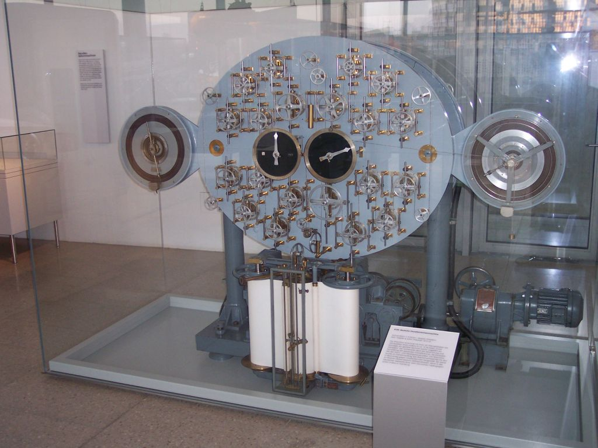
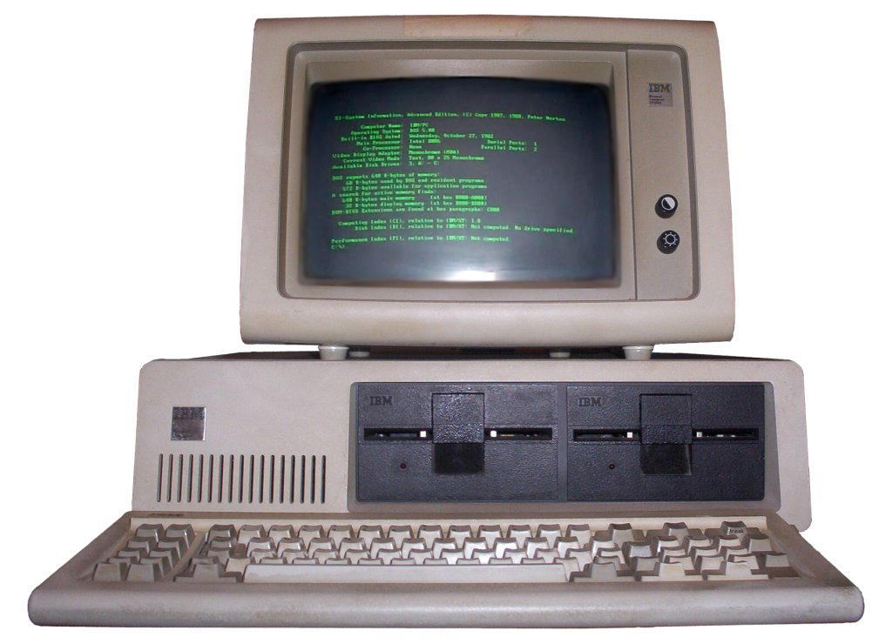
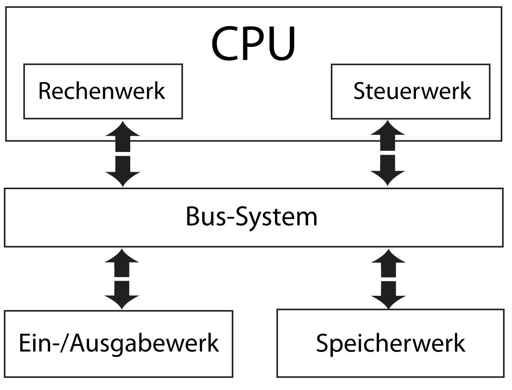
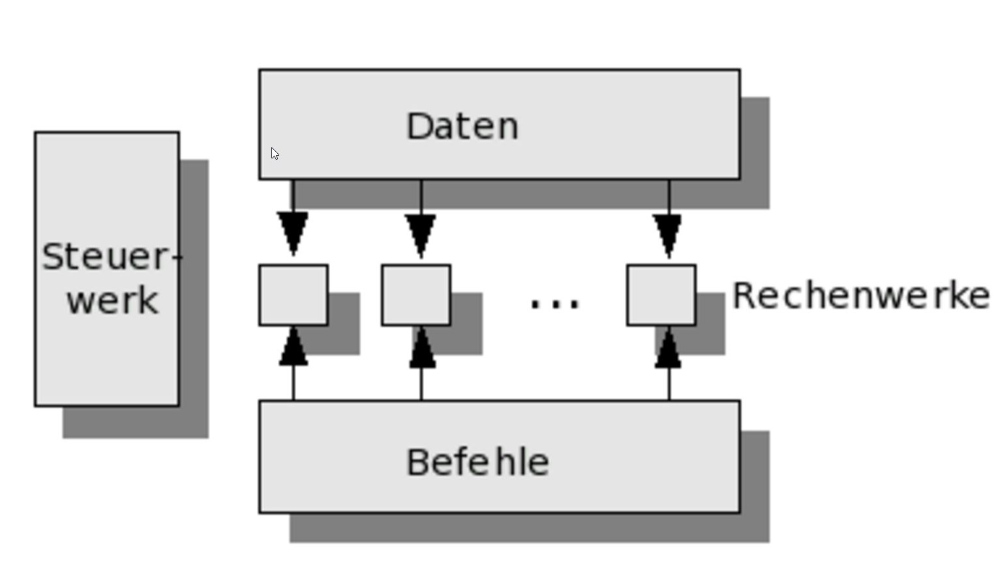
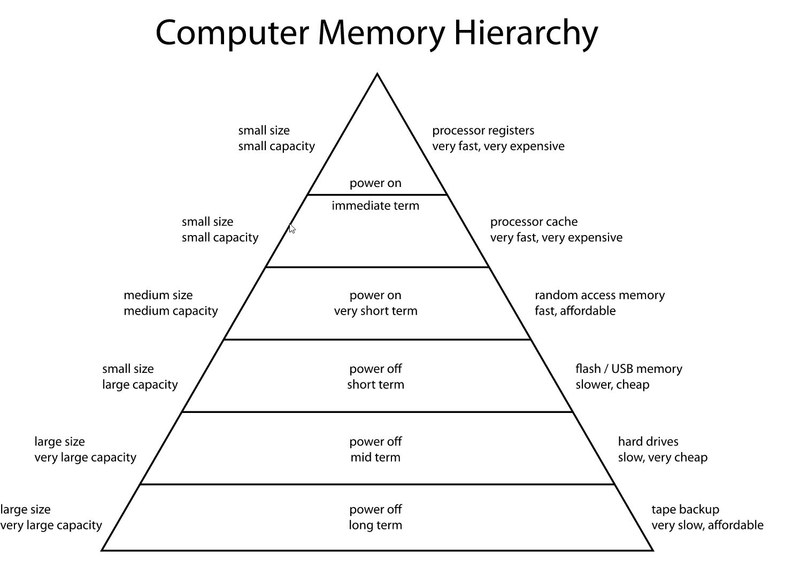

# Computersysteme

## Kleine Fragerunde
* Was bedeutet die Abkürzung IT?
  * Informationtechnology
* Was bedeutet EDV?
  * Elektronische Datenverarbeitung
* Was der Unterschied zwischen _Elektronisch_ und _Elektrisch_
  * _Elektrik ist alles, was mit elektrischem Strom zu tun hat_
  * _Elektronik ist die Datenverarbeitung mithilfe der Elektrik_

## Was bedeutet Digital?

- [lateinisch] digitus „Finger“, [englisch] digit "Ziffer"
- Abzählbarkeit
- Typische Darstellungsform Binär: 0 und 1
- Beispiele:
  - Uhren
    - Auch "Analoguhren" arbeiten digital
    - Pendeluhren und Sonnenuhren nicht, da kein eineindeutiger Zustand

## Was ist ein Computer?

* Sprachlich: _To Compute_, bis ins 19. Jahrhundert ein Beruf von komplexen Berechnungen
* Programmierbarkeit
* Eingabe und Ausgabe
* Instruktionen
* Wiederholbarkeit
* Logische und Mathematische Befehle

## Spielarten von Computersystemen (unvollständig)

* Smartphone
* Personal Digital Assistant oder PDA
* Tabletcomputer
* Eingebettetes System, z.B. im Auto, Fernseher, Waschmaschine usw.
* Einplatinencomputer, z.B. Raspberry Pi
* Personal Computer oder PC
* Hostrechner/Server
* Thin Client
* Heimcomputer (veraltet)
* Spielkonsole
* Laptop oder Notebook
* Mainframes/ Großrechner
* Supercomputer

## Typisierung von Computern

* Analogrechner
  * Keine Zählung von Ergebnissen und Stücken
  * Anzeige des Ergebnisses nicht als diskretes Ergebnis sondern als Messskala, Kurve, Wasserstand, Spannung oder Strömung
* Digitalrechner
  * Relais-Technologie
  * IC-Technologie (Integrated Circuits) - elektronische Schaltung
  * Diskrete Zählerstände
* Hybridrechner

## Erste Computer

# Wie funktioniert ein Computer

## Computerarchitektur (in Theorie)

* Recheneinheit 
  * auch ALU - arithmetisch-logische Einheit
  * auch CPU Central Processing Unit

* Steuereinheit

  _Heute als Einheit auch CPU (Central Processing Unit) genannt_

* Buseinheit

* Speicher

* Ein- und Ausgabeinheit(en)

## Turing-Vollständigkeit

* Alan Turing erfand als Modell die universelle Turingmaschine (mathematisches Konzept)
* Turing-Vollständigkeit ist synonym für universelle Programmierbarkeit
* Ein System, dass turingmächtig ist, kann auch alle Funktionen berechnen, die eine universelle Turingmaschine berechnen könnte
* Aus der Turingvollständigkeit eines Systems ergibt sich,
  das alle turingmächtigen Rechner jede Programmierung _irgendeines_ Computers ausführen kann
* Sie ist damit _universell Programmierbar_
* Erste (eingeschränkt) turingmächtige Maschine: Zuse Z3 (1941)

## Aufbau Theorie

Kokurrierende Referenzmodelle für den theoretischen Computeraufbau:

- Von Neumann-Maschine
- Harvard-Architektur
- Assoziativ-Maschine

## Aufbauschema einer Von-Neumann-Maschine

### Beschreibung der Von-Neumann-Maschine

* Sequentieller Ablauf von Programmen

* Im Speicherwerk liegen Befehle und Daten

* Für das Rechenwerk ist es nicht erkennbar, dass aus einem "Programmbereich" geladen wurde oder aus einem "Datenbereich"

### Programmablauf 
* Befehle werden geladen und Steuersignale an andere Funktionseinheiten gesendet

* Befehle sind in einem RAM-Speicher mit linearem (1-dimensionalem) Adressraum abgelegt.

* Ein Befehls-Adressregister, genannt Befehlszähler oder Programmzähler, zeigt auf den nächsten auszuführenden Befehl.

* Befehle können wie Daten geändert werden.

* Befehle werden aus einer Zelle des Speichers gelesen und dann ausgeführt.

* Normalerweise wird dann der Inhalt des Befehlszählers um Eins erhöht.

* Es gibt einen oder mehrere Sprung-Befehle, die den Inhalt des Befehlszählers um einen anderen Wert als +1 verändern.

* Es gibt einen oder mehrere Verzweigungs-Befehle, die in Abhängigkeit vom Wert eines Entscheidungs-Bit den Befehlszähler um Eins erhöhen oder einen Sprung-Befehl ausführen.

### Beschreibung

Die Struktur des Von-Neumann-Rechners ist unabhängig von den zu bearbeitenden Problemen. Zur Lösung eines Problems muß von außen eine Bearbeitungsvorschrift, das Programm, eingegeben und im Speicherabgelegt werden. Ohne dieses Programm ist die Maschine nicht arbeitsfähig.
Programme, Daten, Zwischen- und Endergebnisse werden in demselben Speicher abgelegt.
DerSpeicher ist in gleichgroße Zellen unterteilt, die fortlaufend durchnummeriert sind. Über die Nummer (Adresse) einer Speicherzelle kann deren Inhalt abgerufen oder verändert werden.
Aufeinanderfolgende Befehle eines Programms werden in aufeinanderfolgenden Speicherzellen abgelegt. Das Ansprechen des nächsten Befehls geschieht vom Steuerwerk aus durch Erhöhender Befehlsadresse um Eins. Durch Sprungbefehle kann von der Bearbeitung der Befehle in der gespeichertenReihenfolge abgewichen werden.

## Harvard-Architektur-Schema

### Beschreibung der Harvard-Architektur

* Daten und Befehle liegen in getrennten Speicherbereichen
* Programmablauf parallel,gleichzeitiges Laden von Daten und Befehlen möglich
* Problem von nicht
* Reine echte Umsetzung nur schwierig möglich, heute durch eigene Caches in der CPU umgesetzt

## Komponenten eines Prozessors/Rechenkern

- ALU
  - Logisch: UND, ODER, XOR, ...
  - Arithmetisch: ADD, SUB, DIV, ...
- Steuerwerk
- MMU (Memory Management Unit)
- Register
  - Datenregister (Akkumulatoren) - Speicher für Operanden und Ergebnisse
  - Adressregister - Speicher für Adressen im Speicherbereich
  - Freie Register - Nutzbar für eigene Programmierung
  - Spezialregister
    - Befehlszähler (Instruction Pointer) 
- Cache

## Datenwort/breite <->- Prozessorarchitektur

- Datenwort oder Binärwort
  - Grundverarbeitungsdatengröße eines Computers
- Die Größe der in Bit wird als Wortbreite oder Busbreite bezeichnet
- Ist die Größe, des Daten,- Steuer- und Befehlsbuses (typischerweise) + Registergröße
- Beschränkt damit den maximal adressierbaren Speicher
  - z.B. 32bit Systeme = 2^32 = 4.294.967.296bits = 4GB
- Typische Größen:
  - 4bit - Taschenrechner, Digitaluhren
  - 8bit - Homecomputer in den 70er und 80er
  - 16bit - erste Personalcomputer - intel x8086
  - 32bit - ältere Pentium prozessoren
  - 64bit - Aktuelle CPU Generationen - Athlon 64, PowerPC G5, Itanium, UltraSparc, Xeon

## Ein- und Ausgabegeräte

* Benutzer

  * Eingabe

  * Ausgabe

* Andere Systeme
  * Schnittstellen
    * unidirektional
    * bidirektional

## Bussysteme

### Datenbus

* überträgt Daten zwischen Computerbestandteilen
* bidirektional

### Adressbus
* Überträgt Speicheradressen
* Die Busbreite, also die Anzahl der Verbindungsleitungen, bestimmt dabei, wie viel Speicher direkt adressiert werden kann
* unidirektional (CPU)
* DMA (Direct Memory Access)- macht den Bus bidirektional

### Steuerbus (Kontrollbus)
* Steuerung (engl. *control*) des Bussystems
* unidirektional
* Lese-/Schreib-Steuerung (Richtung auf dem Datenbus)
* Interrupt-Steuerung
* Buszugriffssteuerung
* der Taktung (falls ein Bustakt erforderlich ist)
* Reset- und Statusleitungen

## Taktgeschwindigkeit/frequenz

* Die Prozessortakt = Ausführungs/Befehlsgeschwindigkeit
* Die Bustakt = In welcher Taktung z.B. Daten über den Bus geladen werden
* Von-Neumann-Flaschenhals
  * Da sich Daten und Befehle einen Bus teilen, kann er zum Flaschenhals werden
  * _Immer nur eine Sache auf einmal_
* Memory-Wall
  * CPU-Takt > Datenbus
  * Je schneller die CPU, desto wahrscheinlicher das Warten auf den Speicherbus

## Befehlssatz

* Sog. Op-Codes (Operation Code)
  * Transferbefehle (Speicher, Register)

  * Arithmetische Befehle

  * Logische Befehle

  * Sprungbefehle
* Deshalb sehen ausführbare Programme auch nicht schön aus im Texteditor :-)
* Hexeditor zum Ansehen von Programmcode
  * Darstellung als Hexadezimalzahl
  * Zwei-Byte-Päarchen
* _Alle Programmiersprache compilieren letzendlich zu OP-Code!_

## Assembler
* Statt 0en und 1en der OP-Codes direkt zu schreiben -> Mnemonics
* Symbole als Textform z.B.
  * MOV
  * ADD
  * SUB
  * JMP
## Prozessorarten nach Befehlssatz

* CISC
  * Complex Instruction Set Computer
  * In einem Takt kann ein complexer Befehl durchgeführt werden
  * Augenmerk auf Mikroprogrammierung der CPU
* RISC
  * Reduced Instruction Set Computer
  * In einem Takt kann nur ein einfacher Befehl durchgeführt werden
  * Augenmerk auf schnelle Taktung

## Prozessorfamilien

* x86
* PowerPC
* ARM
* SPARC

## Speicherhierarchie im Computer

