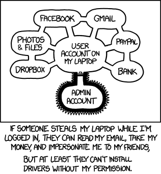

# Betriebssysteme

## Definition "Betriebssystem"

* Ist inhärent Software
* Ist Schnittstelle
  * zwischen Hardware
  * und Anwendung
* Ist für zwei Aufgaben zuständig:
  * Erweiterung der Hardware

  * Verwaltung der Ressourcen

## Erweiterung der Hardware
_Erleichterter Zugriff auf das System - Zugriff bisher nur über OP-Codes möglich_ 

* Vereinfachung und Standarisierung der Ein- und Ausgabe

* Vereinfachung und Standarisierung des Hardwarezugriffes

  * Beispiel: Festplattenzugriff

    _Warum sollte jedes Programm eigens einen Festplattentreiber und Dateisystemdetails implementieren?_

* Bereitstellung von APIs (Application Programming Interface)

  * Zugriff auf Hardwareressourcen

  * Allgemeine Hilfsbibliotheken (Verschlüsselung, 
  * Eigene Bibliotheken (GUI)

## Ressourcenverwaltung
_Verwaltung der vorhandenen Systemkomponenten_

* Als "Prozess Nummer 0" hat das Betriebssystem Vollzugriff auf alle Ressourcen
* Verteilung von "Taktzeiten" von
  * Speicher
  * Rechenzeit
* Unterteilung und Sicherung von Ressourcen (Sicherheit, Isolation, Speicherschutz, Gerechtigkeit/Fairness)
* Ermöglicht damit Multitasking und Multiuser

## Teile eines Betriebssystems

### Kernel

* Abstrahierung der Hardware

* Ressourcenverwaltung

* Isolierung von Prozessen und Speicherbereichen

### Systembibliotheken (APIs)

* APIs– Steuerung aufdie Hardwarezugriff durch die Anwendungssoftware

* Hilfsbibliotheken, bspw. Crypto

## Strukturen von Betriebssystemkerneln
* Monolithische Systeme

  •Alle Komponenten in einem Binaryzusammengefasst

  •Positiv: effiziente Kommunikation, priviligierte Zugriffe jederzeit

  •Negativ: viele Seiteneffekte,Änderungen führen zum Neustart, Fehlerträchtig (komplizierte

  •Strukturen, eine Komponente kannKern abstürzen lassen)

  •Abhilfe: ladbare Module (zurLaufzeit), Schichtmodelle (Memory-, Prozess-, I/O-, File-Manager)

* Client-Server-Kerne / Mikrokernel

  * Auslagerung von Komponenten ineigene Adressräume, Ausführung im Benutzermodus
  * Reduktion auf Basisfunktionen
  * Positiv: leichter zu pflegen,Fehlerfortpflanzung erschwert, Sicherheit
  * Negativ: teurer Kommunikation von Komponenten
  * Weiterentwicklung:  Verteilte System und Middleware (Remote Procedure Call/RPC)

* Virtuelle Maschinen

  * Zusammenfassung mehrerer logischerSysteme auf einer Hardware
  * Durch Hardware (IBM Mainframe,Intel V-Bit, AMD-V)

  oder

  * Virtualisierungssoftware (VMware, XEN, VirtualBox...)

* Exokernel

* Geschichtete Systeme

## Generationseinteilung nach Tanenbaum

* Erste Generation (1945-1955)

  _Röhrenrechner_

  * Maschinencode
  * Singe Process
  * Direktes Programmieren auf derHardware

* Zweite Generation (1955-1965)

  _Mainframes_

  * Transistorencomputer
  * Assembler
  * Batchverarbeitung auf Mainframes
  * Noch kein Multiuser

* Dritte Generation (1965-1980): 

  _Timeshareing_

  * Integrierte Schaltkreise (ICs)
  * Hochsprachen wie C
  * Mainframes: Timesharing, VirtuelleMaschinen
  * Multiuser, Multitask

* Vierte Generation (1980 bis heute)

  _Mikrocomputer_

  * ObjektorientierteProgrammiersprachen
  * Home Computer
  * Personal Computer
  * Teilweise Singleuser, teilweiseMultiuser
  * Verteilte Systeme

## Unterteilung von BS nach Anwendungsgebiet

* Mainframe-OS (IBM OS390)

* Server-OS (Windows Server, Linux)

* PC Betriebsysteme (Windows 10, Linux)

* Echtzeitbetriebssysteme (QNX, VxWorks)

* Embedded Systeme (Emb.Linux, Windows CE)

* Chipkarten Systeme (JVM)

## Unterteilung von BS nach Betriebsart
* Anzahl Benutzer:
  _Single User vs. Multi User_
* Anzahl Prozessen: 
  _Singe Process vs. Multitasking_
* Zeitlich:
  _Batch Processing vs. Interaktiv (Dialog)_

## Betriebssytemkonzepte

* Multitasking

  * Unterschiedliche Arten von Multitasking:
    * Echtzeit OS
    * Kooparatives Multitasking
    * Präemptives Multitasking

* Prozess

  _Kapselung von Anwendung und Speicherbereich, inklusive Registern für Programmzeiger_

* Scheduler

  * Anwendungsunterbrechung durchInterrupt-Steuerung
  * Pointer-Rücksprung indas Betriebssystem und vom OSin die nächste Anwendung

* Deadlocks

  _Konkurrierender Zugriff auf Speicherbereiche müssen gehandhabt werden, sonst kommt es zu sog. Deadlocks_

* Interrupt

  _Ein Interrupt (engl. to interrupt,unterbrechen) ist die kurzfristige Unterbrechung eines Programms, um eine andere, meist kurze, aber zeitkritische Verarbeitung durchzuführen. Ausgelöst durch eine Unterbrechungsanforderung (Interrupt Request,IRQ) wird eine Unterbrechungsroutine (Interrupt Service Routine, ISR) ausgeführt.Anschließend wird die Ausführung des Programms an der Unterbrechungsstelle fortgesetzt. Sinn eines Interrupts ist es, auf Ein-/Ausgabe-Ereignisse (Signale) (z. B. vonTastatur, Maus, Festplatte, Netzwerk, Zeitgeber/Timerusw.) (schnell) reagieren zu können, während ein anderer Programmcode (z. B. von Anwendungsprogrammen) abgearbeitet wird._

# Wie wichtig sind Betriebssystem in der heutigen Zeit?

Bootprozess

Installtionsablauf

Datei / Programm Unterschied

Dateisysteme

