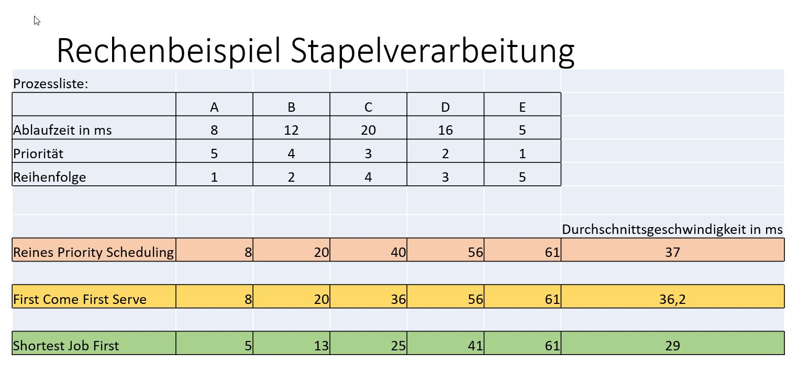

# Rechenbeispiel Prozessscheduler

# Rechenbeispiel Speicherverwaltung

## Optimaler Alogrithmus:2-3-2-1-5-2-4-5-3-2-5-2 

| Hauptspeicher | 1. Tausch | 2. Tausch | 3. Tausch |
| ------------- | --------- | --------- | --------- |
| 2             | 2         | 4         | 2         |
| 3             | 3         | 3         | 3         |
| 1             | 5         | 5         | 5         |

## FIFO: 2-3-2-1-5-2-4-5-3-2-5-2 

| Hauptspeicher | 1. Tausch | 2. Tausch | 3. Tausch | 4. Tausch | 5. Tausch | 6. Tausch |
| ------------- | --------- | --------- | --------- | --------- | --------- | --------- |
| 2             | 3         | 1         | 5         | 2         | 4         | 3         |
| 3             | 1         | 5         | 2         | 4         | 3         | 5         |
| 1             | 5         | 2         | 4         | 3         | 5         | 2         |

## LRU: 2-3-2-1-5-2-4-5-3-2-5-2 

| Hauptspeicher | 1. Tausch | 2. Tausch | 3. Tausch | 4. Tausch |
| ------------- | --------- | --------- | --------- | --------- |
| 2             | 2         | 2         | 3         | 3         |
| 3             | 5         | 5         | 5         | 5         |
| 1             | 1         | 4         | 4         | 2         |

## Ergebnis:

- Optimale Strategie: 3 Ersetzungen 
- FIFO: 6 Ersetzungen
- LRU: 4 Ersetzungen