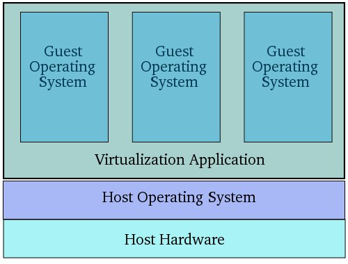
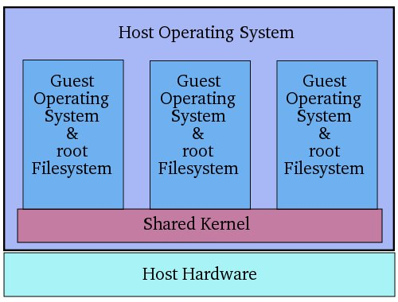
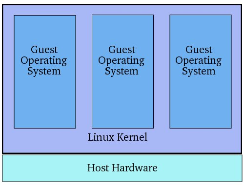
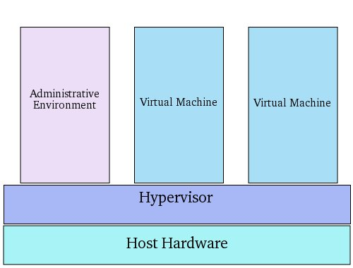
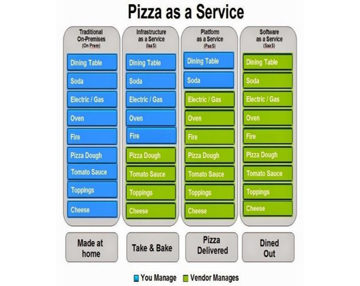

# Virtualisierung

## Gängige Virtualisierungsarten im Computerbereich

- Servervirtualisierung 

- Desktopvirtualisierung 
- Netzwerkvirtualisierung

- Softwarevirtualisierung

## Geschichtliche Einordnung

- Das IT-Thema „Virtualisierung“ ist hochaktuell, doch schon fast 50 Jahre alt.
- Bereitsin den frühen 60ern stellten auf den IBM 370er Großrechnern die ersten Virtual-Maschine-Monitors (VMMs) mit VM/370 ein Multi-User-System zurVerfügung.
- Die Systemsoftware teilte die Hardware in eine beliebige Anzahl von virtuellen Maschinen (VM) auf, von denen jede zu der darunter liegenden Hardware passte.
- Der Vorteil dieser VMMs bestand darin, dass sie die teure Ressource Mainframe vervielfachte. Dass die VMMs in Vergessenheit gerieten, führt man auf dieZunahme von Multitasking-Betriebssystemen und die rasanten Abnahme der Hardwarekosten ab den 80er Jahren zurück.
- Der daraus resultierende Anstieg an Hardware-Ressourcen reduzierte die Auslastungder Serversysteme.
- Außerdem wurden die Systeme auf der Server und Client Seite z.B. auch durch die Vernetzung immer anfälliger für Systemausfälle und Malware mit gleichzeitig steigendem Administrationsaufwand. 

## Vorteile für die IT

- Reduktion von Hardwaremenge und damit Stellfläche
- Senkung von Hardwarekosten und Energiekosten
- Verminderung des Systemverwaltungsaufwands durch Zentralisierung
- Erhöhung der System-Sicherheit durch Fehlertoleranz sowie Verbesserung von Protokollierung,  Intrusion-Detection und Prävention
- Steigerung der System-Verfügbarkeit durch Load-Balancing
- Erhöhung der Produktivität der Mitarbeiter durch flexiblere IT-Infrastruktur
- Senkung der Softwarekosten

## Arten von Servervirtualisierung

### Guest Operating System Virtualization

### Shared Kernel Virtualization

### Kernel Level Virtualization

### Hypervisor Virtualization

#### Arten der HV

- Paravirtualisierung
- Full-Virtualisierung
- Binary Translation
- Hardware-Assisted-Virtualisierung (VT/AMD-V)

## Was hat das ganze mit der Cloud zu tun?

